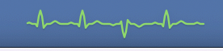

# ECGBar

[](https://github.com/lxhyl/claude-ecg/actions/workflows/ci.yml)


[](LICENSE)

A macOS menubar app that turns Claude Code activity into a live ECG strip.



Each Claude Code hook fires a heartbeat into a scrolling waveform drawn inline in the menubar. When Claude finishes a turn and goes silent, the trace flatlines and the classic continuous ECG flatline tone plays — your "come verify the work" alarm.

## What you see

| Event class | Waveform | Sound | Color |
|---|---|---|---|
| Normal hooks (`PreToolUse`, `PostToolUse`, `UserPromptSubmit`, `SubagentStart/Stop`, `PreCompact`, `PostCompact`, `SessionStart`) | Full PQRST spike | 880 Hz blip | green |
| Long-running tool (no hook fires) | Soft "resting rate" filler beat every ~2 s | silent | green |
| Tool failure (`PostToolUseFailure`, `PermissionDenied`) | Inverted spike | 392 Hz low tone | green |
| Attention required (`Notification`, `PermissionRequest`) | Doublet (twin spike) | two-note chime | **purple, persistent** |
| `Stop` | Normal spike, then 3 s grace | blip | green → orange → red |
| `StopFailure` | Inverted spike, then 3 s grace | low tone | green → orange → red |
| 3 s after `Stop`/`StopFailure` with no further activity | Flat line | 2.5 s 1 kHz alarm | red → grey idle |
| `SessionEnd` | Normal spike, immediate flatline | blip + alarm | red → grey idle |

A 3-second debounce after `Stop` cancels the alarm if any new hook arrives — so multi-turn conversations don't keep firing the flatline.

If no events at all arrive for 10 minutes (e.g. a session died without ever sending `Stop`), ECGBar goes quietly idle without sounding the alarm.

## Requirements

- macOS 13+
- Swift 5.9+ (Xcode toolchain or `xcode-select --install`)
- Claude Code

## Install

### Option A — download a release

Grab `ECGBar-vX.Y.Z.zip` from [Releases](https://github.com/lxhyl/claude-ecg/releases), unzip, and move `ECGBar.app` to `/Applications`.

The app is ad-hoc signed (no Apple Developer ID), so macOS quarantines the download. Either right-click → **Open** and confirm, or:

```bash
xattr -dr com.apple.quarantine /Applications/ECGBar.app
```

To start it automatically, add it to **System Settings → General → Login Items**.

### Option B — build the app bundle yourself

```bash
make app
```

This builds `build/ECGBar.app` (ad-hoc signed, no quarantine since it was built locally). Move it to `/Applications` and launch it.

### Option C — run the raw binary

```bash
swift build -c release
./.build/release/ECGBar
```

In all cases the app installs itself as a status-bar accessory (no Dock icon) and listens on `127.0.0.1:7823`.

Click the menubar item for status, mute toggles, a manual test-beat trigger, and the hook-installation snippet.

## Wire it to Claude Code

Click the menubar item → **Install Claude Code hooks…** → **Copy**, then merge the snippet into `~/.claude/settings.json`.

The full snippet is also in [`docs/hooks-snippet.json`](docs/hooks-snippet.json). It covers 15 hook events:

```
SessionStart, SessionEnd, UserPromptSubmit,
PreToolUse, PostToolUse, PostToolUseFailure,
SubagentStart, SubagentStop,
Notification, PermissionRequest, PermissionDenied,
PreCompact, PostCompact,
Stop, StopFailure
```

Open a new Claude Code session after editing `settings.json` so the harness picks up the changes.

## Configuration

The listening port defaults to `7823`. To change it (first match wins):

```bash
# 1. environment variable
ECGBAR_PORT=7900 ./.build/release/ECGBar

# 2. user default (persists across launches)
defaults write ECGBar port -int 7900        # raw binary
defaults write com.lxhyl.ECGBar port -int 7900   # app bundle
```

The in-app hooks snippet always reflects the active port. If you change the port, re-install the hooks.

Mute states for the heartbeat blip and the flatline alarm are toggled from the menu and persist across launches.

## Architecture

Single SwiftPM executable. Zero external dependencies.

| File | Role |
|---|---|
| `Sources/ECGBar/main.swift` | Entry point, sets `NSApp.setActivationPolicy(.accessory)` |
| `Sources/ECGBar/AppDelegate.swift` | `NSStatusItem`, menu, mute persistence, hooks-snippet panel |
| `Sources/ECGBar/AppConfig.swift` | Version, port resolution, defaults keys |
| `Sources/ECGBar/ECGView.swift` | Custom `NSView` — ring buffer, PQRST template, 60 Hz redraw that pauses when the trace is flat |
| `Sources/ECGBar/HeartbeatEngine.swift` | State machine (`idle`/`active`/`attention`/`armed`/`flatlining`), filler timer, flatline arming |
| `Sources/ECGBar/BeatKind.swift` | Pure event → (waveform, sound, state consequence) mapping |
| `Sources/ECGBar/HookServer.swift` | `NWListener` on `127.0.0.1` — `POST /heartbeat?e=…`, `POST /refresh` (back-compat), `GET /healthz` |
| `Sources/ECGBar/HTTPRequestHead.swift` | Minimal HTTP request-line parser |
| `Sources/ECGBar/HooksSnippet.swift` | Generates the settings.json hooks snippet |
| `Sources/ECGBar/AudioPlayer.swift` | Synthesises PCM tones, writes to temp `.caf`, plays via `NSSound` |
| `Sources/ECGBar/Timer+CommonModes.swift` | Timers that keep firing while menus are open |

Audio uses `NSSound` rather than `AVAudioEngine` so it survives output-device switches (e.g. when OBS or other recording tools change the system default output mid-session).

All timers run in `.common` run-loop modes so the waveform keeps scrolling and the flatline countdown keeps counting while a menu is open. The 60 Hz render ticker pauses automatically once the trace flattens, so an idle ECGBar uses no CPU.

## Development

```bash
make build   # release build
make test    # unit tests
make run     # build & run
make app     # build ECGBar.app into ./build
```

CI runs `swift build` and `swift test` on every push and pull request.

### Manual testing

```bash
# health check
curl http://127.0.0.1:7823/healthz

# fire any beat type
curl -X POST 'http://127.0.0.1:7823/heartbeat?e=PreToolUse'
curl -X POST 'http://127.0.0.1:7823/heartbeat?e=PostToolUseFailure'
curl -X POST 'http://127.0.0.1:7823/heartbeat?e=PermissionRequest'

# stop → 3 s armed → flatline alarm
curl -X POST 'http://127.0.0.1:7823/heartbeat?e=Stop'
```

## Contributing

Issues and pull requests are welcome. Please run `swift test` before submitting, and keep the zero-dependency footprint.

## License

[MIT](LICENSE).
